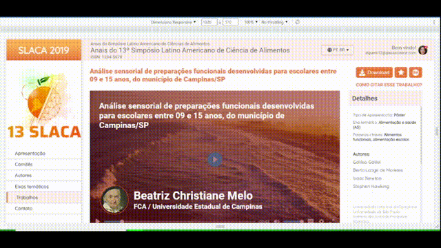

<a href="README.md" target="_blank">Read this page in english<a/> 

# Exercício Front End Chuva.inc
## Link: https://allanbismarck123.github.io/exercicio-frontend-chuvainc/

## 
## ✨ Descrição

#### 
O projeto consiste em um exercício proposto no processo seletivo para estagiário em desenvolvimento front end da empresa Chuva.inc, foi proposto um layout de site através de prototipação no Figma e a partir daí desenvolve-se o projeto utilizando tecnologias de desenvolvimento web. Esse trabalho foi feito pensando em uma responsividade prática e fácil.

## ✨ Tecnologias usadas 

  
  
  

